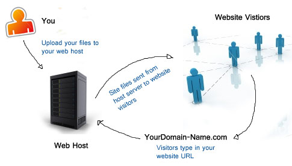

# 了解 Web 主机

> Web 主机服务是一种互联网托管服务，可以让个人或机构制作可在万维网中访问的网站。Web 主机服务商是为客户租用或使用的服务器提供空间及互联网连接的公司，通常服务器位于数据中心。Web 主机服务商还能为其数据中心的其它服务器提供空间与网络连接，这种服务被称为托管服务，类似于拉美与法国的住房托管。

><cite>&#8212; [Wikipedia](https://en.wikipedia.org/wiki/Web_hosting_service)</cite>

<cite>图源：<a href="http://www.alphaelite.com.sg/sitev2/images/stories/webhostdemo.jpg">http://www.alphaelite.com.sg/sitev2/images/stories/webhostdemo.jpg</a></cite>

##### 综合学习：

* [什么是 Web 主机服务](https://firstsiteguide.com/web-hosting/) [阅读]
* [Web Hosting 101 课程：立刻让你的网站上线](https://www.udemy.com/web-hosting-101/) [视频]

<cite>图源：<a href="https://firstsiteguide.com/wp-content/uploads/2016/06/what-is-web-hosting-infographic.jpg">https://firstsiteguide.com/wp-content/uploads/2016/06/what-is-web-hosting-infographic.jpg</a></cite>

