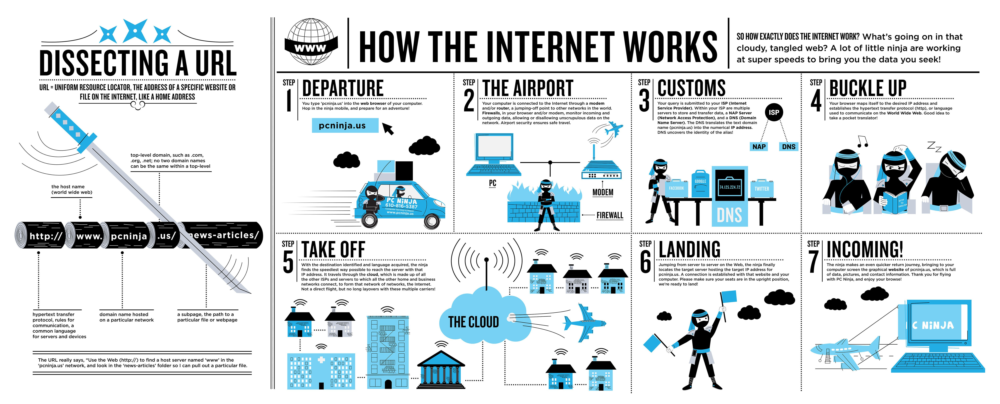
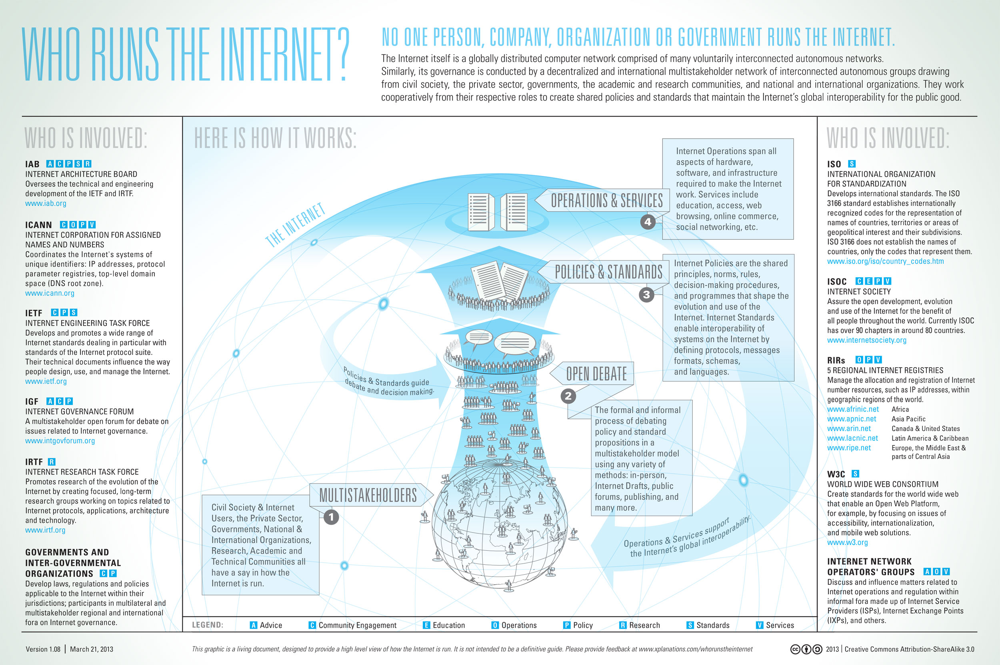

# 了解互联网 / 万维网

> 互联网或国际网（英语：Internet），是网络与网络之间所串连成的庞大网络，这些网络以一组标准的网络 TCP/IP 协议族相连，连接全世界几十亿个设备，形成逻辑上的单一巨大国际网络。它是由从地方到全球范围内几百万个私人的、学术界的、企业的和政府的网络所构成，通过电子，无线和光纤网络技术等等一系列广泛的技术联系在一起。这种将计算机网络互相联接在一起的方法可称作“网络互联”，在这基础上发展出覆盖全世界的全球性互联网络称互联网，即是互相连接一起的网络。互联网并不等同万维网（WWW），万维网只是一个基于超文本相互链接而成的全球性系统，且是互联网所能提供的服务其中之一。互联网带有范围广泛的信息资源和服务，例如相互关系的超文本文件，还有万维网的应用，支持电子邮件的基础设施，点对点网络，文件共享，以及 IP 电话服务。

><cite>&#8212; [维基百科](https://en.wikipedia.org/wiki/Internet)</cite>

<cite>图片来源：<a href="https://www.helloitsliam.com/2014/12/20/how-the-internet-works-infographic/">https://www.helloitsliam.com/2014/12/20/how-the-internet-works-infographic/</a></cite>

* [什么是 Internet?](https://www.youtube.com/watch?v=Dxcc6ycZ73M) [watch]
* [Web 是怎样工作的](https://developer.mozilla.org/en-US/docs/Learn/Getting_started_with_the_web/How_the_Web_works) [read]
* Internet 是怎样工作的? [https://developer.mozilla.org/en-US/docs/Learn/Common_questions/How_does_the_Internet_work](https://developer.mozilla.org/en-US/docs/Learn/Common_questions/How_does_the_Internet_work) and 
[http://web.stanford.edu/class/msande91si/www-spr04/readings/week1/InternetWhitepaper.htm](http://web.stanford.edu/class/msande91si/www-spr04/readings/week1/InternetWhitepaper.htm) [read]
* [Internet 是如何工作的？](https://www.khanacademy.org/partner-content/code-org/internet-works) [watch]
* [Internet 如何在 5 分钟内工作](https://www.youtube.com/watch?v=7_LPdttKXPc) [watch]
* [Web 是如何工作的](https://www.eventedmind.com/classes/how-the-web-works-7f40254c) [watch]
* [What Is the Internet? Or, "You Say Tomato, I Say TCP/IP"](http://www.20thingsilearned.com/en-US/what-is-the-internet/1) [read]
* [不要惧怕 Internet](http://www.dontfeartheinternet.com/)

<cite>图片来源： <a href="http://www.bitrebels.com/technology/find-out-who-runs-the-internet-chart/">http://www.bitrebels.com/technology/find-out-who-runs-the-internet-chart/</a></cite>
