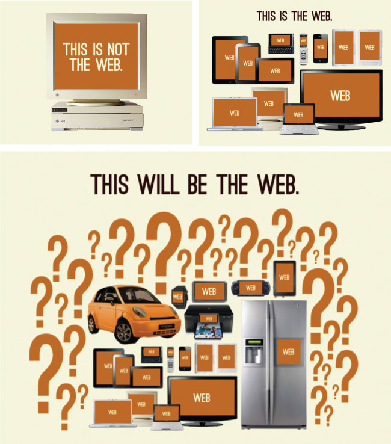

# 学习多设备开发

<cite>图片来源： <a href="http://bradfrost.com/blog/post/this-is-the-web/">http://bradfrost.com/blog/post/this-is-the-web/</a></cite>

网站或者 web 应用不仅可以运行在各种台式机、笔记本、平板和手机上，同样也能在为数不多的新设备上运行（智能手表、温控器、冰箱等）。所谓的“多设备开发策略”就是先决定要支持哪些设备，然后打算如何开发以支持这些设备。下面列出了最常见的多设备开发策略。

* 为所有设备构建一个[响应式（响应式 Web 设计）](https://en.wikipedia.org/wiki/Responsive_web_design) 的 web 站点或应用。
* 为所有设备构建一个[自适应/渐进增强](https://en.wikipedia.org/wiki/Adaptive_web_design)的 web 站点或应用。
* 为每一种设备或每一组设备分别构建一个网站、web 应用、原生 app 或混合 app。
* 尝试使用第一、第二或第三种策略中的一部分来改造现有的站点。

##### 通用知识:

* [A book Apart Pack - 响应式 Web 设计](https://abookapart.com/collections/responsive-design) [阅读][$]
* [A Book Apart Pack - 为所有的设备设计](https://abookapart.com/collections/design-for-any-device) [阅读][$]
* [自适应 Web 设计](https://www.amazon.com/gp/product/0134216148?&_encoding=UTF8&tag=frontend-handbook-20&linkCode=ur2&linkId=defa398e66db76e7edbb8ddfa28caa1e&camp=1789&creative=9325) [阅读][$]
* [渐进式增强设计](https://www.amazon.com/Designing-Progressive-Enhancement-Building-Everyone/dp/0321658884/?&_encoding=UTF8&tag=frontend-handbook-20&linkCode=ur2&linkId=bdac6f12a3d24fe694468aa8145001eb&camp=1789&creative=9325) [阅读][$]
* [移动端 Web 开发](https://www.udacity.com/course/mobile-web-development--cs256) [观看]
* [响应 HTML 电子邮件设计](https://frontendmasters.com/courses/responsive-email/) [观看][$]
* [响应式图片](https://www.udacity.com/course/responsive-images--ud882) [观看]
* [响应式排版](https://www.pluralsight.com/courses/responsive-typography) [观看][$]
* [响应式 Web 设计](https://frontendmasters.com/courses/responsive-web-design/) [观看][$]
* [响应式 Web 设计基础](https://www.udacity.com/course/responsive-web-design-fundamentals--ud893) [观看]

##### 响应式设计新闻简报，新闻站点和播客：

* [响应式 Web 设计播客](https://responsivewebdesign.com/podcast/)
* [响应式 Web 新闻简报](https://responsivewebdesign.com/newsletter/)

