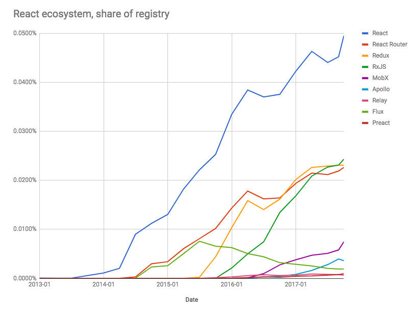

# 学习 React

##### 学习 React：

* [ReactJS 初学指南](https://egghead.io/courses/the-beginner-s-guide-to-reactjs) [文章]
* [对仅仅知道 jQuery 的人介绍 React.js](http://chibicode.com/react-js-introduction-for-people-who-know-just-enough-jquery-to-get-by/) [文章]
* [关于 React 你必须知道的 13 件事情](http://aimforsimplicity.com/post/13-things-you-need-to-know-about-react/) [文章]
* [教程: 介绍 React](https://facebook.github.io/react/tutorial/tutorial.html) [文章]
* [对初学者来说，ReactJS 意味着什么](http://blog.andrewray.me/reactjs-for-stupid-people/) [文章]
* [对 React 的完整介绍，v3 (feat. Redux, Router & Flow)](https://frontendmasters.com/courses/react/) [视频][$]
* [React 🎄](https://react.holiday/) [文章]
* [React 入门](https://www.reactenlightenment.com/) [文章]
* [ReactJS 教程 - Reactjs 介绍和环境安装](https://www.youtube.com/watch?v=MhkGQAoc7bc&t=6s) [视频]

##### 掌控 React：

* [构建你的第一个高质量 React 应用](https://egghead.io/courses/build-your-first-production-quality-react-app) [视频][收费]
* [先进的 React 组件模式](https://egghead.io/courses/advanced-react-component-patterns) [视频][收费]
* [React 模式](https://reactpatterns.com/) [文章]
* [8 个关键的 React 组件要点](https://medium.freecodecamp.org/8-key-react-component-decisions-cc965db11594) [文章]
* [React + Mobx 代码库，包含遵守 RealWorld 规范和 API 的真实世界示例（CRUD，auth 和先进的规则等等）](https://github.com/gothinkster/react-mobx-realworld-example-app) [代码]
* [React Router 的介绍和路由选择的原理](https://medium.freecodecamp.org/react-router-v4-philosophy-and-introduction-730fd4fff9bc) [文章]

***

###### 说明：

如果你已经掌握了 React，那么可以继续学习强大的状态管理解决方案，比如：[MobX](https://mobx.js.org/)。如果你对函数式编程很熟练，那么可以看一下 [Redux](https://redux.js.org/)。如果你需要了解除了 React 的 `setState` 之外的状态管理角色，“[React 中的高级状态管理 (Redux 和 MobX)](https://frontendmasters.com/courses/react-state/)”。

当你迁移到 React 技术栈，并学习需要和 React 配合使用的工具时，请注意下面的 React 生态系统趋势图（基于 npm 仓库）。

