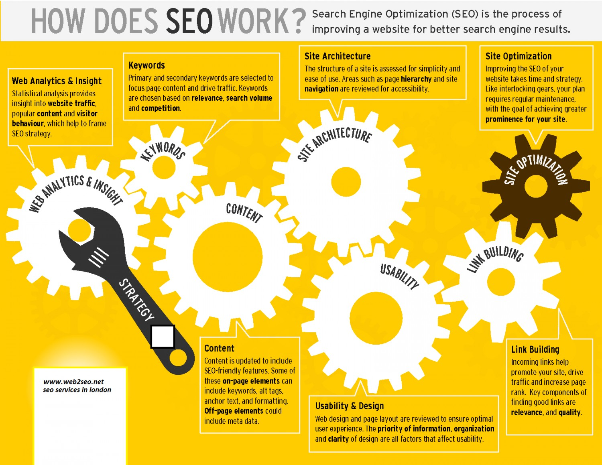

# 学习搜索引擎优化（SEO）

> 搜索引擎优化（SEO）是一个在未付费情况下影响网页或网站的排名高低的过程 —— 常常被称为“自然的”或“应得的”结果。总体而言，一个网站在搜索结果页面出现的越早（或者在搜索结果页中排名更高），且越经常地出现在搜索结果的列表里， 它就越能从搜索引擎处获得更多的访问者。SEO 可能会针对不同种类的搜索，包括图片搜索，本地搜索，视频搜索，学术搜索，新闻搜索以及特定业界的垂直搜索引擎。

><cite>&#8212; [Wikipedia 维基百科](https://en.wikipedia.org/wiki/Search_engine_optimization)</cite>

SEO 是如何工作的.png

<cite>图片来源： <a href="https://visual.ly/community/infographic/computers/how-does-seo-work">https://visual.ly/community/infographic/computers/how-does-seo-work</a></cite>

##### 概要学习：

* [谷歌搜索引擎优化初学者指南](http://static.googleusercontent.com/media/www.google.com/en//webmasters/docs/search-engine-optimization-starter-guide.pdf) [阅读]
* [现代 SEO](https://frontendmasters.com/workshops/modern-seo/) [观看][$]
* [David Booth：SEO 基础](http://www.lynda.com/Analytics-tutorials/SEO-Fundamentals/187858-2.html) [观看][$]
* [Paul Wilson：SEO 基础](http://www.pluralsight.com/courses/seo-fundamentals) [观看][$]
* [2016 SEO 初学者课堂](http://www.hobo-web.co.uk/seo-tutorial/) [阅读]
* [Web 设计者所需的 SEO](https://webdesign.tutsplus.com/courses/seo-for-web-designers) [观看][$]

 

