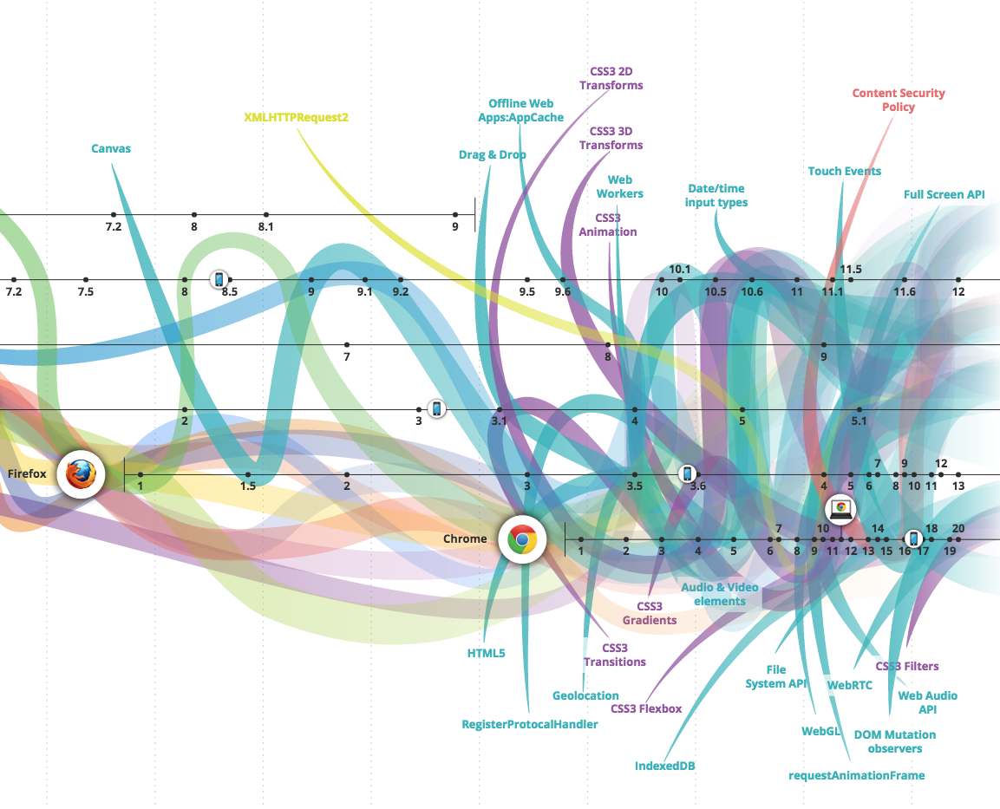

# 学习 Web/浏览器 APIs

<cite>图片来源: <a href="http://www.evolutionoftheweb.com/">http://www.evolutionoftheweb.com/</a></cite>

BOM（浏览器对象模型）和 DOM（文档对象模型）不是浏览器内部 Web 平台上唯一可用的浏览器 API。除了跟 DOM 或者 BOM 有关的接口外，其他基于浏览器开发的接口都可以被视为 Web 或浏览器 API（不幸的是，在过去，这些 API 中的一些被称为 HTML5 API，它们将自己的特性/标准与实际 HTML5 规范中指定 HTML5 标记语言相混淆）。请注意，Web 或浏览器 API 确实包含设备 API（例如[`Navigator.getBattery()`](https://developer.mozilla.org/en-US/docs/Web/API/Navigator/getBattery)）
这些API可通过平板电脑和手机设备上的浏览器访问。

在适当的情况下，您应该了解并学习 Web/浏览器 API。
熟悉所有这些 API 的好工具是浏览[HTML5test.com 5个最新浏览器的结果](https://html5test.com/compare/browser/index.html)。

MDN 提供了大量有关 Web/浏览器 API 的信息。

* [MDN Web API 参考](https://developer.mozilla.org/en-US/docs/Web/Reference/API)
* [MDN Web API 接口参考 - 按字母顺序排列的所有接口](https://developer.mozilla.org/en-US/docs/Web/API)
* [MDN WebAPI - 列出设备访问 API 和其他对应用程序有用的API](https://developer.mozilla.org/en-US/docs/WebAPI)

请记住，并非每个 API 都由 W3C 或 WHATWG 指定。

除了 MDN，以下资源也有助于了解所有的 Web/浏览器 API：

* [HTML 5 JavaScript API 索引](http://html5index.org/)
* [HTML5 概览](http://html5-overview.net/current)
* [platform.html5.org](https://platform.html5.org/)

