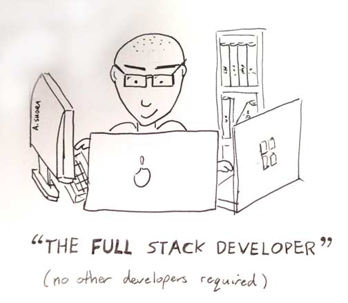
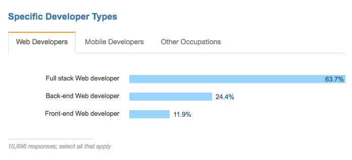

# 通用/全栈的神话

<cite>图片来源：<a href="http://andyshora.com/full-stack-developers.html">http://andyshora.com/full-stack-developers.html</a></cite>

能够设计和实现一个 Web 解决方案的角色，需要在视觉设计，UI/交互设计，[前端开发](https://github.com/kamranahmedse/developer-roadmap#-front-end-roadmap)和[后端开发](https://github.com/kamranahmedse/developer-roadmap#-back-end-roadmap)领域有深厚的技术沉淀和丰富的经验。任何能够达到上述四个角色中的一个或者多个的专家级水平，是一件极其罕见的事情。

在实际生活中，你应当寻求去成为，或者雇佣一个上述角色中的专家（例如，视觉设计，交互设计/IA，前端开发，后端开发）。那些声称在一个或者多个角色中有专家级别的操作的人很罕见，而且更可能是虚构的。

不管怎样，鉴于 JavaScript 已经渗透到技术栈的各个层面（例如 React，node.js，express，couchDB，gulp.js etc...）以至于找到一个能够同时编写前端和后端代码的全栈JS开发者变得没有那么困难。一般来讲，这些全栈开发者只和 JavaScript 打交道。一个能够编写前端代码，后端代码，API 和数据库的开发者不再像以前一样荒谬（包括视觉设计，交互设计和 CSS）。但我觉得仍然是很困难的，只是不再像以前那样不平常。因此，我不建议一个开发者立志成为一个全栈开发者。在极少的情况下，它是可行的。但是，根据通常的构建前端开发者职业生涯的概念上，我会只关注前端技术。

***

###### 说明:

“全栈”开发者这个词已经具备了多种含义。太多的情况，这个词在使用的时候没有一个意思是明确的。请考虑下面展示的两项调查的结果。这些结果会让人相信大多数开发人员都是全栈开发人员。但是，在我20年的经验里，这是不对的。

<cite>图片来源：<a href="https://medium.freecodecamp.com/we-asked-15-000-people-who-they-are-and-how-theyre-learning-to-code-4104e29b2781#.ngcpn8nlz">https://medium.freecodecamp.com/we-asked-15-000-people-who-they-are-and-how-theyre-learning-to-code-4104e29b2781#.ngcpn8nlz</a></cite>

<cite>图片来源：<a href="https://insights.stackoverflow.com/survey/2017#developer-profile-specific-developer-types">https://insights.stackoverflow.com/survey/2017#developer-profile-specific-developer-types</a></cite>

 

