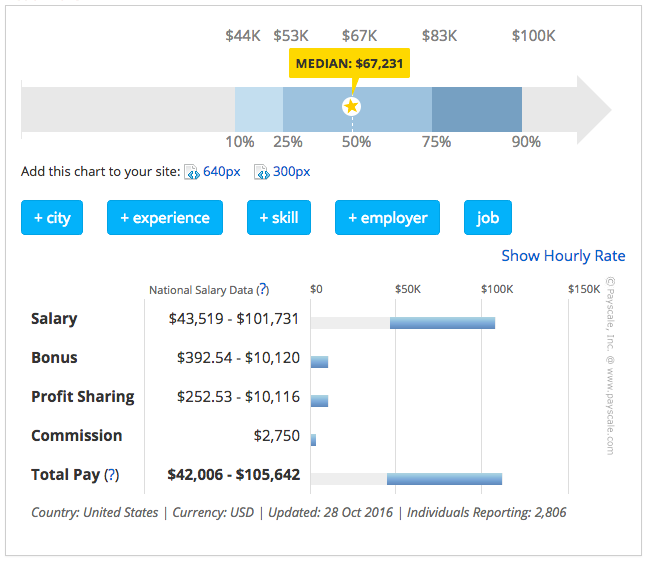
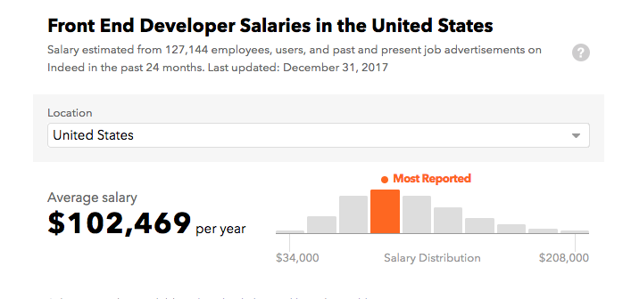

# 前端薪资

在美国，中等水平的前端开发者的全国平均薪资水平介于 [$75k](https://www.glassdoor.com/Salaries/front-end-developer-salary-SRCH_KO0,19.htm)  和 [100k](https://medium.com/javascript-scene/top-javascript-libraries-tech-to-learn-in-2018-c38028e028e6) 之间。

<cite>图片来源: <a href="https://www.glassdoor.com/Salaries/front-end-developer-salary-SRCH_KO0,19.htm">https://www.glassdoor.com/Salaries/front-end-developer-salary-SRCH_KO0,19.htm</a></cite>

<cite>图片来源: <a href="https://www.indeed.com/salaries/Front-End-Developer-Salaries">https://www.indeed.com/salaries/Front-End-Developer-Salaries</a></cite>

当然，当你第一次开始到即将进入大约 43K 的领域取决于你的职位和职务。

***

###### 注意:

一位主管/高级前端开发人员/工程师可以居住在他们想要的任何地方（即远程工作），并且每年可赚取超过 15 万美元（参见 [angel.co](https://angel.co/jobs), 注册并查看超过 $150k 的前端工作或查阅 [Stack Overflow Jobs](https://stackoverflow.com/jobs?q=front-end&sort=y) 的工资范围）。

 

