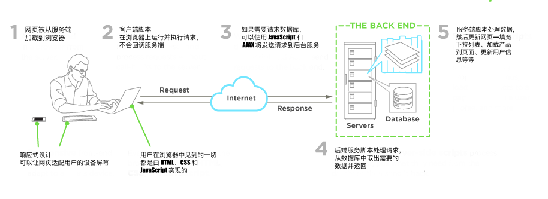

# 何谓前端开发者

> Web 前端开发，也称为客户端开发，是通过为网站或者 Web 应用编写 HTML、CSS 和 JavaScript，使用户可以与之交互的一种实践。与前端开发相关的挑战是，由于开发前端页面的工具和技术日新月异，开发者需要持续关注前端领域的发展。

> 设计网站的一个目标是确保当用户打开网站时，网站所要呈现的信息以一种容易理解、与设备相适应的形式展示在他们面前。现在用户们使用的设备有着各种各样不同的屏幕尺寸和分辨率，这使得展示的适配变得更加复杂，因此设计师在设计网站时，必须同时考虑到这些因素。设计师要确保网站在不同的浏览器（跨浏览器）、不同的操作系统（跨系统）和不同的设备（跨设备）上都能正确展示，为此，开发者在开发时需要有周详的计划和考虑。

><cite>https://en.wikipedia.org/wiki/Front-end_web_development</cite>

##### HTML, CSS, & JavaScript:

前端开发者在搭建和开发网站和应用的时候，使用的是一些在[开放 Web 平台](https://en.wikipedia.org/wiki/Open_Web_Platform)上运行，或者是在非 Web 平台上，作为编译输入（比如 [React Native](https://facebook.github.io/react-native/)）的 Web 技术（比如 [HTML](https://developer.mozilla.org/en-US/docs/Web/HTML)、[CSS](https://developer.mozilla.org/en-US/docs/Web/CSS)、[DOM](https://developer.mozilla.org/en-US/docs/Web/API/Document_Object_Model) 以及 [JavaScript](https://developer.mozilla.org/en-US/docs/Web/JavaScript))）。

<cite>图片来源：<a href="https://www.upwork.com/hiring/development/front-end-developer/">https://www.upwork.com/hiring/development/front-end-developer/</a></cite>

一般来说，一个刚开始进入前端领域的人通常需要学习 HTML、CSS、JavaScript，这些技术通常应用在 [Web 浏览器](https://en.wikipedia.org/wiki/Web_browser)上，不过也可以运行在[无界面浏览器](https://en.wikipedia.org/wiki/Headless_browser)，[WebView](http://developer.telerik.com/featured/what-is-a-webview/)上，或者在一个 native 运行时环境下，作为编译输入。下面讲介绍这四种运行时环境的应用场景。

##### Web 浏览器（最常见）

Web 浏览器是用来获取、展示、遍历 [WWW](https://en.wikipedia.org/wiki/World_Wide_Web) 上的信息。浏览器通常运行在台式机、笔记本、平板或者手机上，但现在似乎在任何设备上都能看到浏览器的身影（比如在冰箱上、在汽车上）。

最常见的 Web 浏览器如下（按[常用度](https://en.wikipedia.org/wiki/Usage_share_of_web_browsers#Summary_tables)排序）：

* [Chrome](http://www.google.com/chrome/)
* [Safari](http://www.apple.com/safari/)
* [Internet Explorer](https://en.wikipedia.org/wiki/Internet_Explorer) (Note: not [Edge](http://dev.modern.ie/), referring to IE 9 to IE 11)
* [Firefox](https://www.mozilla.org/firefox/)
* [Edge](https://www.microsoft.com/en-us/windows/microsoft-edge)

##### 无界面浏览器

无界面浏览器是指没有图形界面的浏览器，开发者可以在命令行窗口对其进行一些自动化的操作（如功能测试、数据爬虫、单元测试等）。你可以这么认为，无界面浏览器是一种可以让你通过命令行获取和遍历网页数据的浏览器。

最常见的无界面浏览器有：

* [Headless Chromium](https://chromium.googlesource.com/chromium/src/+/lkgr/headless/README.md)
* [Zombie](https://github.com/assaf/zombie)
* [slimerjs](http://slimerjs.org/)

##### Webviews

[Webviews](http://developer.telerik.com/featured/what-is-a-webview/) 被应用于原生系统（比如 [iOS](https://developer.apple.com/library/ios/documentation/UIKit/Reference/UIWebView_Class/)、[android](http://developer.android.com/reference/android/webkit/WebView.html)、[windows](https://msdn.microsoft.com/library/windows/apps/windows.ui.xaml.controls.webview.aspx)），用于在一个原生应用程序中，加载网页。[Webview](http://developer.telerik.com/featured/what-is-a-webview/) 就像是被嵌入到设备上的原生应用程序的一个网页小窗口或者一个标签页。

常见的开发 Webview 的技术有：

* [Cordova](https://cordova.apache.org/) (typically for native phone/tablet apps)
* [NW.js](https://github.com/nwjs/nw.js) (typically used for desktop apps)
* [Electron](http://electron.atom.io/) (typically used for desktop apps)

##### Web Native 技术

最后，我们可以从 Web 浏览器开发上学到的是前端开发者甚至可以在不基于浏览器引擎的环境上开发代码。现在有一些前端开发环境已经实现了不依赖 Web 引擎地使用Web技术（例如 CSS 和 JavaScript）来创建原生应用程序。 

这些环境有：

* [Flutter](https://flutter.io/)
* [React Native](https://facebook.github.io/react-native/)

* * *

###### 注意：

确保你已经知道 Web platform 具体是什么。为此，你可以阅读["什么是 Web platform"](http://tess.oconnor.cx/2009/05/what-the-web-platform-is)，以及["Open Web Platform"](https://en.wikipedia.org/wiki/Open_Web_Platform)。你也可以看一下组成 Web platform 的[一些技术](https://platform.html5.org/)。
